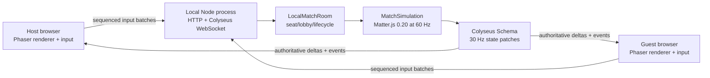
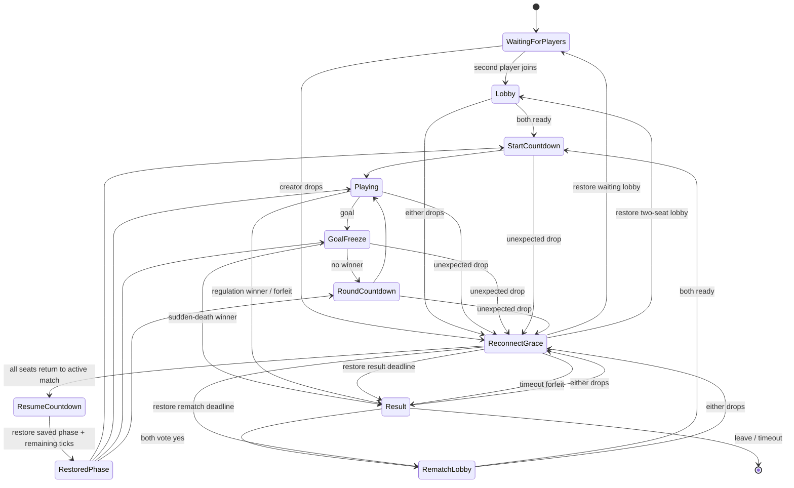

# Joel Football — Multiplayer Approach

**Version:** 1.0  
**Date:** 2026-07-10  
**Status:** Proposed implementation plan  
**Scope:** A four-character selectable roster and a two-player, same-network match  
**Target:** Preserve the current solo game while adding a reliable LAN mode

---

## 1. Executive decision

Implement LAN multiplayer as a **server-authoritative 1v1 game** hosted by a small local Node.js process:

- The host process serves the production Vite build and a Colyseus WebSocket endpoint from the same LAN origin.
- Both browsers are clients. Even the browser running on the host computer sends inputs to the Node process and receives authoritative state back.
- The Node process runs the only authoritative Matter.js simulation at 60 ticks per second.
- Clients send sequenced input frames, render server snapshots, interpolate the opponent and ball, and predict/reconcile only their own fighter.
- Colyseus synchronizes room state at 30 patches per second and manages room capacity, lifecycle, heartbeats, reconnection, and binary state deltas.
- A host lobby shows a scannable QR code and the same join details in text: host, port, room code, and six-digit PIN.
- The QR encodes a URL such as:

  ```text
  http://192.168.1.42:2567/#/join?room=J7K4Q2&pin=482731&v=1
  ```

  The fragment keeps the room and PIN out of the initial HTTP request, ordinary access logs, and referrer headers. The loaded game reads it client-side.
- For this implementation, more “players” means a larger **character roster** from which the human, AI opponent, host, and guest can select. The launch roster is exactly four characters, and the match remains one fighter per side. Supporting three or more simultaneous fighters is a separate game-design/networking scope and is not part of this approach.

The essential prerequisite is to extract physics and rules from Phaser scene objects into a Phaser-free shared simulation. Replacing the heuristic provider with a network provider is not sufficient: it would leave two independently running Matter worlds, which would diverge on collisions, goals, timers, powers, and resets.

### What this plan intentionally does not choose

- No peer lockstep or deterministic rollback across browsers.
- No browser-only WebSocket host; browsers cannot listen for inbound WebSocket connections.
- No WebRTC-first topology. WebRTC still needs signaling and would make a browser tab authoritative.
- No public cloud dependency for the LAN match.
- No host migration in the first release.
- No ranked play or trusted persistent Power Lab inventory without an account backend.

---

## 2. Scope and product assumptions

### Included

1. A four-character, data-driven launch roster with selectable human and opponent characters.
2. Existing solo play against the heuristic AI, now using the same character and simulation definitions as multiplayer.
3. A host/join LAN lobby for exactly two active players.
4. QR quick-connect plus complete manual connection details.
5. Server-authoritative physics, scoring, powers, timer, sudden death, reset, result, and rematch.
6. Desktop and touch input on either side.
7. Ready state, character/loadout selection, countdown, reconnect grace, forfeit, and rematch voting.
8. Interpolation, local prediction, reconciliation, network diagnostics, and multiplayer tests.
9. English and Spanish lobby/error copy.
10. The existing static Netlify build remaining playable in solo mode.

### Not included in the first release

- More than two simultaneous fighters or spectators.
- Internet matchmaking, NAT traversal, relay servers, accounts, chat, or voice.
- Host migration if the local Node process exits.
- Trusting client-provided coordinates, scores, cooldowns, inventory counts, or collision results.
- Secure play on an untrusted public network. The first LAN host uses HTTP/WebSocket and is intended for a trusted home, classroom, or private hotspot.
- Automatic browser access to mDNS/DNS-SD discovery. QR and manual entry are the required discovery mechanisms.
- IPv6-only LANs. LAN v1 advertises and accepts private IPv4 addresses; IPv6/ULA plus bracketed invite URLs are a follow-up.

### Distribution assumption

The core LAN v1 is an engineering release: the host computer must have Node.js 22 or newer and run `npm run lan:host`. A one-click desktop launcher is explicitly post-v1 productization and is not part of the core definition of done; it does not change the networking or simulation architecture.

---

## 3. Findings from the current game

The current code is a strong single-player base, but match authority is concentrated in browser/Phaser objects.

| Current area | Finding | Multiplayer consequence |
|---|---|---|
| Runtime | Phaser 3.90.0, Phaser-bundled Matter.js 0.20.0, Vite 6.4.3, ES modules | Pin standalone `matter-js@0.20.0` so the Node simulation begins from the same physics version. |
| Game loop | `MatchScene.update()` accumulates 1/60 logic steps, while Phaser normally advances Matter separately | Current play is not a single explicitly stepped deterministic unit. Extract one simulation that calls `Matter.Engine.update()` exactly once per tick. |
| State ownership | `MatchScene` owns score, phases, timers, fighters, ball, powers, collision reactions, reset, and result | These mutations must move into `MatchSimulation`; the network scene becomes presentation and input only. |
| Fighters | `Fighter` mixes Matter bodies, state/timers, Phaser sprite frames, audio events, and aura drawing | Split into a Phaser-free `FighterModel` and a `FighterView`. |
| Ball/goal | `Ball` and `Goal` mix Matter creation with Phaser images | Split simulation geometry from render views. |
| Inputs | `InputController.sample()` already produces normalized movement plus edge actions | Keep this contract and encode it into fixed-tick network input frames. |
| Provider seam | Human and AI return `{ move, jump, kick, lob, dash, power }` | Retain providers as input sources, not as distributed state synchronization. |
| Async provider | `BufferedAsyncAgentProvider` caches the last result and defaults to slow request intervals | Appropriate for AI/LLM calls, unsafe for live player input because stale movement could remain held. Do not use it for LAN input. |
| Snapshots | `createWorldSnapshot()` is deliberately compact and AI-facing | Keep/rename it as `createAgentSnapshot`; define a separate, versioned network state. |
| Identities | Joel/Vex IDs, art, names, collision lookup, HUD, and result text are hardcoded | Separate seat, simulation entity ID, character ID, and display name. This also permits mirror matches safely. |
| Power inventory | Joel’s equipped power and charges are read from and written to localStorage | Local storage is not trustworthy shared state. LAN charges must be match-scoped and server-owned. |
| Randomness | Ball release/reset uses `Phaser.Math.FloatBetween()` | Replace gameplay randomness with a seeded server PRNG; leave particles and screen shake client-local. |
| Pause/restart | Either local scene can pause Matter or restart the scene immediately | LAN v1 has no server pause; restart/rematch/forfeit are authoritative lifecycle actions and one client cannot reset the match unilaterally. |
| Deployment | The published game is static files copied into another static site | Static Netlify hosting cannot accept LAN players. A local runtime is required for hosting; the existing static path stays solo-capable. |

Relevant current seams include:

- `src/game/scenes/MatchScene.js` creation/update and collision methods: match ownership, logic accumulation, strikes, combat, powers, goals, and reset.
- `src/game/entities/Fighter.js` constructor and action methods: compound Matter body, sprite, state, and movement in one class.
- `src/game/input/InputController.js` `sample()`: normalized local intent.
- `src/game/pure/snapshot.js`: AI snapshot, not a wire schema.
- `src/game/pure/rules.js`: useful pure scoring/clock rules.
- `src/game/scenes/IntroScene.js`: fixed character presentation and direct match start.
- `src/game/scenes/BootScene.js`: fixed asset loading.

### Baseline verification during this investigation

At the initial exploration snapshot on 2026-07-10:

- `npm test`: 37 tests passed.
- `npm run build`: passed; the existing Phaser bundle-size warning remained.
- `npm run test:e2e`: passed the then-current splash, settings/audio, Power Lab, Big Guy, enhanced powers, gameplay, and touch flows.
- The required web-game Playwright client reached countdown and live play; its text diagnostics confirmed both fighter states, score/timer state, inputs, powers, and the 1280×720 coordinate system.

At document handoff, after additional working-tree changes, `npm test` passed 44 tests and `npm run build` still passed with the same bundle warning. Two browser-suite reruns did not complete: they stopped at different existing tablet settings touch assertions (`music slider` and `mute effects`). This documentation task did not change gameplay code. Treat the earlier passing browser run plus the later failures as an explicit pre-implementation baseline issue to stabilize; Phase 0 must restore a repeatable green browser suite before simulation extraction.

---

## 4. Library and topology decision

### 4.1 Selected stack

Use Colyseus 0.17 over its default `ws` WebSocket transport, a standalone Matter.js 0.20.0 server simulation, and `qrcode` for invite rendering.

Versions verified on 2026-07-10 should be pinned exactly in the lockfile because Colyseus is still pre-1.0:

| Package | Version | Role |
|---|---:|---|
| `colyseus` | `0.17.10` | Server, rooms, lifecycle, matchmaker |
| `@colyseus/core` | `0.17.44` | Explicitly pin the core selected by the meta-package |
| `@colyseus/ws-transport` | `0.17.13` | WebSocket transport, heartbeat, limits |
| `@colyseus/schema` | `4.0.27` | Typed room state and binary property deltas |
| `@colyseus/sdk` | `0.17.43` | Browser client |
| `@colyseus/testing` | `0.17.11` | Two-client room integration tests |
| `matter-js` | `0.20.0` | Phaser-free server/shared physics |
| `qrcode` | `1.5.4` | QR canvas generation in the host lobby |
| `express` | `5.2.1` | Health/LAN-info routes and serving `dist/` |

Set the package engine to Node `>=22`. Current `@colyseus/core` and `@colyseus/testing` require Node 22 or newer.

Why Colyseus fits:

- Its room model is server-authoritative and has a built-in simulation interval.
- Only the server mutates synchronized Schema state; clients send requests/inputs.
- Schema synchronization sends property changes rather than a complete JSON object every update.
- It supplies room capacity/locking, message routing, heartbeat/disconnect detection, and reconnection lifecycle.
- It has current Phaser tutorials for fixed ticks, interpolation, and predicted input.
- The default transport uses the mature `ws` implementation.

Official references:

- [Colyseus state synchronization](https://docs.colyseus.io/state)
- [Colyseus rooms, 60 Hz loop, 20 Hz default patch rate, capacity, and rate limits](https://docs.colyseus.io/room)
- [Colyseus transport and heartbeat behavior](https://docs.colyseus.io/server/transport)
- [Colyseus WebSocket transport](https://docs.colyseus.io/server/transport/ws)
- [Colyseus 0.17 migration/package guidance](https://docs.colyseus.io/migrating/0.17)
- [Colyseus Phaser fixed-tick tutorial](https://docs.colyseus.io/learn/tutorial/phaser/fixed-tickrate)
- [Colyseus package](https://www.npmjs.com/package/colyseus)

### 4.2 Alternatives considered

| Option | Strengths | Why it is not the primary choice |
|---|---|---|
| Socket.IO 4.x | Very mature transport, rooms, reconnection, acknowledgements, fallbacks | It does not provide a game-state model, authoritative simulation, delta schema, interpolation, prediction, or reconciliation. Its default event arrival is at-most-once, so substantially more netcode remains custom. See [delivery guarantees](https://socket.io/docs/v4/delivery-guarantees/) and [connection recovery](https://socket.io/docs/v4/connection-state-recovery). |
| Raw `ws` | Small and fast | Recreates room lifecycle, schema/deltas, reconnect, validation conventions, testing helpers, and diagnostics already supplied by Colyseus. |
| PeerJS/raw WebRTC | Direct encrypted peer-to-peer data channels and potentially low latency | WebRTC still requires signaling. A browser tab becomes authoritative, can be suspended, has a host advantage, and its loss ends the match. State synchronization remains custom. See [WebRTC connectivity/signaling](https://developer.mozilla.org/en-US/docs/Web/API/WebRTC_API/Connectivity) and [data channels](https://developer.mozilla.org/en-US/docs/Web/API/WebRTC_API/Using_data_channels). |
| Trystero | Convenient WebRTC room abstraction | Default discovery depends on public relays/networks; self-hosting restores the server requirement. It has no authoritative shared-game-state solution. |
| PartyKit/Cloudflare Durable Objects | Good cloud stateful WebSocket primitives | Traffic and authority are cloud-hosted, so this is not offline same-LAN play; physics and netcode remain custom. |
| Nakama | Mature authoritative multiplayer backend | Separate service/container/database operations are excessive for one local 1v1 room. It becomes attractive only with accounts and Internet matchmaking. |

### 4.3 Why a local process is necessary

The browser WebSocket API creates outbound client connections; it does not open a listening server socket. WebRTC permits peer data, but peers must first exchange offer/answer and ICE information through an out-of-band signaling channel. Browser JavaScript also has no general-purpose multicast DNS/DNS-SD discovery API.

Therefore a true offline LAN host needs a local runtime. The host process binds to the LAN, serves the exact client build that guests load, and owns the room simulation.

Do not have the public Netlify page connect directly to `ws://192.168.x.x`. Besides mixed-content differences, Chrome 147 expanded Local Network Access restrictions to WebSockets targeting local addresses. A top-level navigation to the local host followed by same-origin HTTP/WebSocket traffic is the more robust design. See [Chrome 147 release notes](https://developer.chrome.com/release-notes/147) and [Local Network Access](https://developer.mozilla.org/en-US/docs/Web/Security/Defenses/Local_network_access).

---

## 5. Target architecture



### Authority boundaries

The server owns:

- Seat assignment and room capacity.
- Character definitions, stats, collider presets, and match loadouts.
- The Matter world and all body transforms/velocities.
- The 60 Hz tick, seeded gameplay RNG, and timer ticks.
- Movement results, collisions, kicks, combat, stun, freeze, shield, Hyper, Big Guy, warp, boomerang, power ball, countering, and meter changes.
- Goals, score, sudden death, result, forfeit, reset, and rematch.
- Accepted input sequence numbers and dead-man neutralization.

Clients own:

- Raw keyboard/touch input.
- Language, audio volume/mute, and other local presentation preferences.
- Sprite rendering, local speculative pose, particles, trails, camera shake, and sound.
- Snapshot buffering, interpolation, local movement prediction, and visual correction.
- Local menus and diagnostics.

Clients never send position, velocity, score, timer, meter, cooldown, hit, goal, or power-consumption results.

### Process topology

- `npm run dev` continues to run the existing development client/solo game.
- `npm run lan:host` builds the current sources, starts the local server on port `2567`, serves `dist/`, exposes `/health` and `/api/lan-info`, and prints candidate LAN URLs.
- The host opens `http://localhost:2567`, chooses **LAN Match → Host**, and creates a room.
- The guest navigates to the local URL via QR or manual entry. Both game assets and WebSocket traffic then use the local origin.
- At startup the client probes same-origin `/api/lan-info` with a short timeout. A valid LAN-host response enables **Host**. The Netlify/static build receives no such response, disables **Host**, explains the Node host command, and still offers **Join** as a top-level redirect to a supplied local address.
- The existing Netlify/static publishing path keeps shipping solo mode; it never pretends that a browser tab can host a room.

---

## 6. Character roster design

### 6.1 Separate identity concepts

Do not use a character ID as a physics or client identity.

| Concept | Example | Purpose |
|---|---|---|
| Seat | `left` | Stable match role and scoring side |
| Simulation entity ID | `player:left` | Matter labels and state lookup |
| Public player ID | random room-scoped value | UI/diagnostics without exposing reconnect tokens |
| Character ID | `joel` | Art, tuned stats, collider preset, localized name |
| Session/reconnect token | Colyseus private token | Rejoining the reserved seat; never synchronized/logged |

Matter labels become `player:left:head`, `player:left:body`, and `player:left:foot`, not `joel:head`. This permits both players to choose the same character without collision lookup ambiguity.

### 6.2 Data-driven catalog

Add `src/shared/characters.js`, containing only plain serializable data and no Phaser/browser imports:

```js
export const CHARACTERS = Object.freeze([
  {
    id: 'joel',
    nameKey: 'character.joel.name',
    assets: {
      portrait: 'player-nova.png',
      sheet: 'player-nova-sheet.png',
      frameWidth: 418,
      frameHeight: 627,
    },
    display: { width: 185, height: 240 },
    stats: { speed: 1.08, jump: 1.04, kick: 1, dash: 1, power: 1 },
    collider: {
      head: { radius: 43, x: 0, y: -52 },
      torso: { width: 50, height: 64, x: 0, y: 27 },
      foot: { width: 46, height: 14, x: 17, y: 63 },
    },
    colors: { primary: 0x6ef4ff, secondary: 0xe95d45 },
  },
  // Vex and future characters use the same contract.
]);
```

Rules:

- IDs are stable, lowercase, URL-safe, and never reused.
- Server and client import the same catalog.
- A client sends only `characterId`; the server resolves stats and colliders from its catalog.
- Stats remain in an approved range and are balance-reviewed. Do not accept arbitrary stats in room options.
- Every animated character initially supplies the existing six semantic frames: idle, run, jump, kick/lob, dash, stun.
- A future character can define different collider dimensions, but the collider schema remains common.
- Side tint/HUD colors distinguish mirror matches.
- `FighterModel.spawnAt(x, groundY)` positions the compound body by its computed `body.bounds.max.y`, so every collider rests on `GROUND_Y`; no character may reintroduce the current hardcoded `GROUND_Y - 89` spawn assumption.

The launch roster is exactly:

| ID / name | Assets | Stats `{speed,jump,kick,dash,power}` | Collider/colors |
|---|---|---|---|
| `joel` / JOEL | Existing `player-nova.png` and six-frame sheet | `{1.08, 1.04, 1.00, 1.00, 1.00}` | Existing compound collider; `0x6ef4ff` / `0xe95d45` |
| `vex` / Bob | Existing `player-vex.png` and six-frame sheet | `{1.00, 1.08, 1.04, 1.00, 1.05}` | Existing compound collider; `0xffad72` / `0x705cff` |
| `luna` / LUNA | New `player-luna.png` and `player-luna-sheet.png` | `{1.04, 1.12, 0.96, 1.06, 0.96}` | Common collider; `0xc58cff` / `0x5de0e6` |
| `bruno` / BRUNO | New `player-bruno.png` and `player-bruno-sheet.png` | `{0.96, 0.98, 1.12, 0.96, 1.04}` | Common collider; `0xffd15c` / `0x57c978` |

Luna and Bruno require original portrait art plus six semantic animation frames, English/Spanish name keys, fallback colors, asset-source/processing notes, Big Guy scaling checks, touch-legibility screenshots, AI compatibility tests, and a balance pass. Keep the common collider for the first roster release; character-specific colliders remain supported by the catalog but should not add a second balance variable yet.

### 6.3 Selection flow

Solo:

1. **Play vs AI** opens `CharacterSelectScene`.
2. Player selects their fighter and an opponent fighter.
3. The scene creates a `MatchConfig` and starts the local match.
4. The heuristic provider controls the configured opponent seat.

LAN:

1. Host or guest enters `LocalMatchLobbyScene`; every input, HUD, camera cue, and touch-control label binds to the server-assigned `localSeat`, never an assumption that the local player is left.
2. Each client changes only its own character and loadout.
3. Server validates the ID, updates the corresponding `PlayerState`, and clears that player’s ready flag.
4. Both players press Ready.
5. Server locks selection and begins countdown.

### 6.4 Profile migration

Raise the profile schema from version 4 to version 5 and add:

```js
{
  preferredCharacterId: 'joel',
  preferredOpponentCharacterId: 'vex'
}
```

`sanitizeProfile()` must validate both IDs against the catalog and fall back to Joel/Vex. These are preferences, not trusted multiplayer facts.

### 6.5 Files changed for the roster

- Add `src/shared/characters.js` and pure catalog tests.
- Change `BootScene.preload()` and fallbacks to iterate catalog assets.
- Add `CharacterSelectScene` and register it in `src/main.js`.
- Change `IntroScene` to show **Play vs AI** and **LAN Match**.
- Replace `HUMAN_PLAYER_ID`/`HUMAN_PLAYER_NAME` uses with `MatchConfig`/catalog values.
- Change HUD and result copy to use selected localized character names.
- Change collision lookup to use seats/entity IDs.
- Extend `PlayerProfile` with validated character preferences.
- Extend `render_game_to_text()` with seat and character IDs.
- Add the two original Luna/Bruno portrait/sheet assets, source notes, fallback art, localization, screenshots, and catalog balance tests.

---

## 7. Extracting the shared simulation

This is the highest-risk and most important phase. Complete it and prove solo parity before introducing networking.

### 7.1 New Phaser-free modules

```text
src/
├── shared/
│   ├── characters.js
│   └── multiplayer/
│       ├── protocol.js
│       ├── stateMachine.js
│       ├── prng.js
│       └── tickMath.js
└── game/
    ├── simulation/
    │   ├── MatchSimulation.js
    │   ├── FighterModel.js
    │   ├── BallModel.js
    │   ├── createMatterWorld.js
    │   ├── simulationSnapshot.js
    │   └── simulationEvents.js
    └── render/
        ├── FighterView.js
        ├── BallView.js
        ├── GoalView.js
        └── MatchPresentation.js
```

`MatchSimulation` must run in Node without DOM, canvas, Phaser, audio, localStorage, or `window`.

### 7.2 Simulation API

```js
const simulation = new MatchSimulation({
  config,
  seed,
  matter: Matter,
});

simulation.step({ left: leftIntent, right: rightIntent });

const state = simulation.getPresentationState();
const events = simulation.drainEvents();
```

Required methods:

- `step(intents)`: advance exactly one 1/60 tick.
- `getPresentationState()`: complete immutable state needed to render or initialize a network schema.
- `createAgentSnapshot()`: compact immutable state for the heuristic provider.
- `drainEvents()`: return ordered one-shot domain events and clear the queue.
- `resetMatch(config, seed)`: start a rematch with new IDs/revisions.
- `serializeForReplay()` and `stateHash()`: deterministic diagnostics in the pinned Node runtime.
- Test-only `setState()` helpers live outside the production public API.

### 7.3 Exact per-tick order

Characterization tests must lock down this order before and after extraction:

1. Advance the authoritative tick.
2. Read one validated intent per seat.
3. Decrement action/effect cooldown ticks and charge passive meter.
4. Resolve facing and begin jump/kick/lob/dash/power actions.
5. Apply movement forces/fast-fall/dash velocity.
6. Resolve geometric kick-to-ball and fighter-to-fighter action windows.
7. Call `Matter.Engine.update(engine, 1000 / 60)` exactly once.
8. Process collision events emitted during that engine update.
9. Clamp ball velocity, release crossbar perches, update bounded power effects, and apply server gameplay PRNG where required.
10. Tick the active match clock.
11. Detect full-ball goal-line crossing and transition phase.
12. Update pose/presentation fields.
13. Emit domain events and produce the presentation projection.

If characterization tests reveal that current Phaser ordering differs materially, preserve the observed behavior rather than silently changing gameplay feel during the networking refactor.

### 7.4 Integer tick timers

Use integer ticks for gameplay timers and phase deadlines. Convert existing durations with one tested helper:

```js
export const secondsToTicks = (seconds) => Math.ceil(seconds * 60);
```

Important equivalents:

| Current duration | Ticks |
|---|---:|
| 90-second match | 5,400 active play ticks |
| 2.7-second initial countdown | 162 |
| 1.65-second goal freeze | 99 |
| 2.4-second normal round countdown | 144 |
| 1.9-second sudden-death countdown | 114 |
| 3.2-second power ball | 192 |

The offline clock stops with the existing true local pause. In LAN mode, the clock decrements whenever the authoritative phase is `PLAYING`, including while either client has its non-pausing local overlay open; it stops only in waiting/countdown/goal-freeze/reconnect phases.

### 7.5 Seeded gameplay randomness

- Generate a 32-bit match seed on the server with `node:crypto`.
- Use a tiny deterministic PRNG in `src/shared/multiplayer/prng.js` for ball release/reset variation.
- Store the seed in replay diagnostics and authoritative room state.
- Never call `Math.random()` or `Phaser.Math.FloatBetween()` for gameplay outcomes.
- Particles, aura wobble, screen shake, and other cosmetic effects may remain non-deterministic on each client.

### 7.6 Simulation events

Events bridge authoritative changes to presentation without putting audio/particles in the model:

```js
{
  eventId: 1032,
  tick: 842,
  matchId: 4,
  roundId: 2,
  type: 'ball-strike',
  actorSeat: 'left',
  targetSeat: null,
  data: { powered: true, superpowerId: 'ice' }
}
```

Include jump, kick start, dash, ball strike, combat hit, stun, shield block, power armed/denied, power shot, counter, freeze, goal, round reset, result, disconnect, reconnect, and forfeit.

### 7.7 Solo adapter

The existing `MatchScene` becomes an offline controller around the same simulation:

- Local human provider supplies left intent.
- Heuristic provider supplies right intent.
- Scene update calls the simulation’s fixed-tick accumulator.
- `MatchPresentation` copies model state to render-only views and consumes domain events.
- No Phaser Matter world controls gameplay after extraction.
- Existing `window.advanceTime(ms)` advances this local simulation exactly as it does today.

Do not begin server networking until solo unit, build, and browser suites pass through this adapter.

---

## 8. LAN host and QR discovery

### 8.1 Server startup

Add scripts:

```json
{
  "scripts": {
    "lan:host": "npm run build && node server/index.js",
    "lan:host:no-build": "node server/index.js",
    "test:server": "vitest run test/server test/simulation",
    "test:multiplayer": "node test/multiplayer-browser.mjs"
  },
  "engines": {
    "node": ">=22"
  }
}
```

Default configuration:

```text
PORT=2567
BIND_ADDRESS=0.0.0.0
LAN_ADDRESS=<optional explicit advertised address>
NODE_ENV=production
```

At startup:

1. Verify `dist/index.html` exists.
2. Bind the HTTP/WebSocket server.
3. Enumerate `os.networkInterfaces()`.
4. Keep non-internal IPv4 RFC1918 addresses by default.
5. Apply `LAN_ADDRESS` if supplied, which solves VPN/multiple-adapter ambiguity.
6. Print `http://localhost:2567` and each candidate LAN URL.
7. Fail clearly on `EADDRINUSE`, with an example showing a different `PORT`.

The server does not need multicast discovery for the MVP. Optional mDNS advertising of a friendly `.local` name can be added later, but QR/manual IP entry must always work.

### 8.2 HTTP routes

- `GET /health` → `{ ok, version, protocolVersion, activeRooms }` without PINs or tokens.
- `GET /api/lan-info` → advertised address candidates, port, protocol version, and build version.
- Static `dist/` files with the Vite hashed asset cache headers.
- A GET-only, Express 5-compatible SPA fallback to `dist/index.html`, registered last so it cannot intercept `/matchmake/*`, `/health`, `/api/*`, or WebSocket upgrade paths. Serve `index.html` with `no-store`; hashed assets may be immutable.
- Colyseus WebSocket/matchmaking routes on the same server/port.

Do not mount Colyseus playground or monitor routes in production LAN mode.

### 8.3 Room/PIN creation

Host sequence:

1. Host browser fetches `/api/lan-info`.
2. It creates a 128-bit base64url `hostClaim` with `crypto.getRandomValues()` and calls `client.create('local_match', { hostClaim, protocolVersion, buildVersion, characterId })`.
3. `LocalMatchRoom.async onCreate()` stores only a SHA-256 digest of that claim, sets `maxClients = 2`, and awaits `setMatchmaking({ private: true, unlisted: true, maxClients: 2 })`.
4. It generates a six-character code from an unambiguous alphabet, collision-checks/reserves it in a process-local active-code set, and assigns it to `this.roomId`. This is the actual Colyseus room ID consumed by `joinById()`, not a separate alias. Retry generation on collision and release the code in `onDispose()`.
5. It generates a six-digit PIN using `crypto.randomInt(100000, 1000000)`. The raw PIN remains a private in-memory room property. It never enters Schema, metadata, health output, or logs.
6. Instance `onAuth()` accepts the matching one-use host claim for the creator; it must not infer the creator from `clients.length === 0`. Guest authentication requires the PIN. The creator claim digest is discarded once the left seat joins.
7. The first client gets the left seat and a direct `host_invite` message containing the actual room ID and PIN.
8. The host immediately stores `{ origin, roomId, pin, createdAt }` in origin- and tab-scoped `sessionStorage`, combines it with the selected LAN origin, and creates the fragment URL. Delete it when the room closes, the host leaves/regenerates, or the waiting-lobby TTL expires.
9. On a creator/left-seat `onReconnect()`, the server directly re-sends `host_invite` only to that authenticated client. The client may cache an early direct message but must not rebuild lobby UI from it until the reconnect full-state-ready barrier. This server refresh path and the session copy both restore QR/manual details after a host page refresh; neither value is synchronized to the guest.

Guest sequence:

1. QR scanner navigates to the host process.
2. `main.js` strictly validates `location.hash` into `PendingLanInvite`, stores it with a ten-minute expiry in tab-scoped session state, then immediately removes the PIN-bearing fragment with `history.replaceState()`. Clear the pending invite on success, explicit cancel, or expiry.
3. Boot and the automatic splash still run so assets load; the first deliberate lobby interaction may perform the browser audio unlock.
4. `LocalMatchLobbyScene` shows the resolved host/room and lets the guest select a character.
5. Guest calls `client.joinById(room, { pin, protocolVersion, buildVersion, characterId })` using the tab-scoped invite, then deletes the stored PIN after successful join.
6. Instance `onAuth()` compares the supplied PIN, validates protocol/build/character, rate-limits failures, and uses stable `ServerError(code, messageCode)` values for failures that actually reach that hook. Locked/full/not-found `joinById()` attempts may be rejected earlier by Colyseus matchmaking and are normalized by `LocalMatchClient` as described in section 8.6.
7. Second client gets the right seat.

### 8.4 QR rendering

Load `qrcode` dynamically only in the host lobby so it does not enlarge the initial solo chunk:

```js
const { default: QRCode } = await import('qrcode');
const canvas = document.createElement('canvas');
await QRCode.toCanvas(canvas, inviteUrl, {
  errorCorrectionLevel: 'M',
  margin: 2,
  width: 224,
});
scene.textures.addCanvas(`invite-${roomId}`, canvas);
```

Host UI must display:

- QR code.
- Address, for example `192.168.1.42`.
- Port, for example `2567`.
- Room, for example `J7K4Q2`.
- PIN, for example `482731`.
- Full copyable URL.
- Network-adapter selector if multiple LAN addresses are available.
- **Regenerate room** action, which invalidates the previous room/PIN.

The QR contains only connection data, never profile inventory, names, reconnect tokens, or long-lived secrets.

**Regenerate room** is enabled only while the host is the sole player in `WAITING_FOR_PLAYERS`/`LOBBY`. It leaves and disposes the old room, revokes its code/PIN, removes the old Phaser QR texture/listeners, and creates a fresh room. It is disabled after a guest joins.

### 8.5 Manual join

`LAN Match → Join` supplies four validated inputs: address, port, room, and PIN.

- Address accepts a private IPv4 literal or a `.local` hostname.
- Port is `1…65535`, defaulting to `2567`.
- Room accepts the configured unambiguous uppercase alphabet.
- PIN is exactly six digits.
- If the current game was loaded from the public site, submission performs a **top-level navigation** to the local fragment URL; it does not attempt a public-origin WebSocket to the LAN.
- If already served by that local origin, the client joins directly.

Implement the manual form with a small DOM overlay (`src/game/ui/LanJoinForm.js`) so phones receive a real software keyboard. Enable Phaser’s DOM container in `src/main.js`; use `inputmode="numeric"` for port/PIN, remove the form on scene shutdown, and keep validation in shared pure helpers. Canvas-drawn pseudo-inputs are not an acceptable mobile fallback.

Because a private-IP HTTP page is not generally a secure context, the Copy button must try `navigator.clipboard.writeText()` and fall back to selecting a read-only DOM field with explicit Ctrl/Cmd+C or long-press guidance. Cache Storage may also be unavailable; audio must retain its existing direct-network fallback.

Local storage is origin-scoped. Preferences saved on the public Netlify origin do not automatically appear under `http://192.168.x.x:2567`; show language/audio controls in the LAN lobby and treat their LAN-origin values as separate local preferences.

### 8.6 User-facing connection errors

Define stable error codes and localized copy:

- `HOST_UNREACHABLE`: confirm same Wi-Fi, address, port, firewall, and guest-network isolation.
- `INVALID_PIN`: retry without revealing whether other room data was correct.
- `ROOM_UNAVAILABLE`: the room is missing, closed, full, or already started; verify the room code or ask the host to regenerate it.
- `PROTOCOL_MISMATCH` / `BUILD_MISMATCH`: reload from the host URL.
- `CONNECTION_LOST` / `RECONNECT_EXPIRED`.
- `SERVER_STOPPED`.

Pre-join creation/auth errors are caught from the rejected SDK matchmaking call (`error.code` plus safe message code); a room message cannot be delivered before `onJoin()`. Reserve `protocol_error`/`room_error` messages for violations that happen after a client has joined.

Use app-owned `ServerError` mappings such as `400/INVALID_INVITE`, `403/INVALID_PIN`, `412/PROTOCOL_OR_BUILD_MISMATCH`, and `429/PIN_RATE_LIMITED`. Colyseus 0.17 checks a locked room and seat reservation before instance `onAuth()`, so distinct `ROOM_FULL` versus `MATCH_ALREADY_STARTED` codes are not promised. `LocalMatchClient` maps the pinned SDK/matchmaker numeric unavailable-room errors to one safe app code, `ROOM_UNAVAILABLE`; pin those mappings in adapter tests and never branch on or display raw framework message text.

---

## 9. Network protocol

### 9.1 Constants

Add `src/shared/multiplayer/protocol.js`:

```js
export const PROTOCOL_VERSION = 1;
export const SIMULATION_HZ = 60;
export const PATCH_HZ = 30;
export const STEP_MS = 1000 / SIMULATION_HZ;
export const MIN_INPUT_DELAY_TICKS = 2;
export const MAX_INPUT_DELAY_TICKS = 6;
export const EDGE_GRACE_TICKS = 2;
export const INTERPOLATION_TICKS = 6;
export const RECONNECT_SECONDS = 15;

export const BUTTON = Object.freeze({
  JUMP: 1 << 0,
  KICK: 1 << 1,
  LOB: 1 << 2,
  DASH: 1 << 3,
  POWER: 1 << 4,
});
```

The module also owns message names, size limits, seat/phase enums, close/error codes outside Colyseus-reserved close codes, and pure validation functions.

### 9.2 Input frame

The exact `input_batch` payload is:

```js
{
  matchId: 4,       // reject packets from an earlier match
  inputEpoch: 7,    // server-issued; changes on join/reconnect/rematch
  frames: [
    {
      seq: 418,          // uint32, monotonically increasing within the epoch
      targetTick: 9421,  // estimated server tick + adaptive input delay
      move: -1,          // exactly -1, 0, or 1
      buttons: 0b00100,  // edge actions; here LOB
    },
  ],
}
```

`matchId` and `inputEpoch` appear once on the batch envelope; frames never repeat them. Each new epoch starts `seq` at **1** and authoritative `lastProcessedInputSeq` at **0**, which unambiguously means no frame has been acknowledged yet.

Client behavior:

- Sample `InputController` at 60 Hz.
- Normalize `Up + Kick` into LOB before encoding.
- Batch two frames and send at 30 packets per second.
- Flush immediately when any edge button is present.
- Send gameplay batches with `room.sendUnreliable('input_batch', batch)`. On an open WebSocket they retain its ordering/reliability, but Colyseus will not buffer them across a dropped connection.
- Cap a batch at four frames and a local unacknowledged history at 180 frames.
- Send a neutral frame on blur, local forfeit, or controlled shutdown.
- Compute `desiredInputDelayTicks` once per RTT sample as `clamp(ceil(((rttMs / 2) + 2 * jitterMs) / STEP_MS), 2, 6)`. Move `effectiveInputDelayTicks` toward it by at most one tick per second: increases take effect on the next frame; decreases use the edge-safe catch-up turn defined in section 12.2. This covers the document’s measured p95 LAN target better than a fixed two-tick delay while bounding added latency.
- Run the local predictor on the same future tick assigned to the frame, not on the current estimated server tick. Section 12.2 defines that mapping; sampling, predictor stepping, and pose projection happen before the next render so a new local input is visible within one frame.

Server behavior:

- Validate object shape, finite integers, match/epoch, sequence, tick range, movement, and button mask.
- Require sequences to be contiguous from 1 and `targetTick` to be nondecreasing within an epoch. Frames for a different `matchId`/`inputEpoch`, duplicate/stale sequences, gaps, or decreasing target ticks are rejected and counted; repeated gaps neutralize/disconnect the sender.
- Queue valid frames by `(targetTick, seq)` with a hard per-seat cap of 32; reject/mark processed frames more than six ticks in the future.
- At each tick, remove **all** frames with `targetTick <= serverTick`. Use the newest due frame’s held `move`, OR together eligible edge bits once, and mark every removed sequence as processed even when its edges are deliberately dropped.
- Preserve edge bits only when `serverTick - targetTick <= EDGE_GRACE_TICKS`; older due frames may update held movement but have their buttons cleared. Cooldowns plus the OR operation prevent repeated same-tick actions.
- If no frame is due, repeat the last held movement and clear all edge buttons.
- If no valid input arrives for 250 ms, force neutral movement and actions.
- On queue overflow or repeated malformed/rate-abusive input, neutralize first and then disconnect according to a tested threshold.
- Track finalized sequence numbers in a bounded set and replicate `inputEpoch` plus `lastProcessedInputSeq` as the **highest cumulatively finalized prefix**. Applied and intentionally dropped frames are finalized, but acknowledgement never jumps over a lower sequence that is still pending. For example, if seq N is queued for T+2 and seq N+1 is rejected as too-future, ACK remains N-1 until N is applied; it then advances through N+1.
- Replicate authoritative `heldMove` (`int8`) with every player. It is the predictor’s movement baseline after an ACK and reflects dead-man/overflow neutralization even when no pending client frame remains.
- Use ordinary unsigned comparison and **never wrap inside an epoch**. Sequence zero is invalid, gaps are rejected, and a new epoch restarts at one. The server's 12-hour hard room lifetime makes exhaustion impossible at 60 samples per second; if a client nevertheless reaches `0xffffffff`, neutralize it and close with `INPUT_SEQUENCE_EXHAUSTED` rather than accepting a wrapped value.

WebSocket/TCP supplies ordered reliable delivery while connected. Set `room.reconnection.maxEnqueuedMessages = 0`, stop sampling/sending on client `onDrop`, clear unsent batches and predictor history, and neutralize/clear the server seat queue in server `onDrop`. In server `onReconnect()`, clear that queue, increment/project `inputEpoch`, and return; Colyseus's automatic reconnect JOIN/full-state handshake then carries the new epoch. Only after the client full-state-ready barrier does it start a fresh sequence at one with acknowledgement zero. No pre-drop action is retried.

### 9.3 Client-to-server messages

| Message | Payload | Allowed phase |
|---|---|---|
| Create options | host claim, protocol/build, character ID | Room creation |
| Join-by-ID options | PIN, protocol/build, character ID | Room join |
| `configure_player` | character ID, network power ID | Lobby/rematch lobby |
| `set_ready` | boolean | Lobby/rematch lobby |
| `input_batch` | match ID, epoch, up to four validated frames | Countdown/playing; ignored while frozen |
| `ping` | nonce and client monotonic time | Any connected phase |
| `vote_rematch` | boolean | Result |
| `forfeit` | confirmation nonce | Active match |

### 9.4 Server-to-client messages

| Message | Purpose |
|---|---|
| Schema patches | Continuous shared truth |
| `host_invite` | Private room/PIN message to the creator only |
| `game_event` | Ordered one-shot presentation events |
| `pong` | RTT/clock-offset estimation |
| `protocol_error` | Stable validation/version code |
| `room_error` | Post-join lifecycle/action rejection only |

State-changing events use `this.broadcast('game_event', event, { afterNextPatch: true })`, preserving event order after the corresponding Schema projection. Clients deduplicate events by `(matchId, eventId)`.

---

## 10. Shared room state

Colyseus Schema is the replicated **presentation projection**, not the mutable Matter world itself. Internal simulation state may contain additional serials/contact data that clients never need.

Use nested schemas to stay comfortably below the 64-field-per-schema limit.

### 10.1 RoomState

```text
protocolVersion       uint16
buildVersion          string
serverTick            uint32
matchId               uint32
roundId               uint32
seed                   uint32
phase                  string/enum
phaseReason            string/enum
phaseEndsAtTick        uint32
resumePhase            string/enum
resumePhaseTicksLeft   uint32
leftGraceEndsAtUnixMs  float64
rightGraceEndsAtUnixMs float64
clockTicksRemaining    uint32
leftScore              uint16
rightScore             uint16
suddenDeath            boolean
winnerSeat             string
resultReason           string
leftRematchVote        boolean
rightRematchVote       boolean
resultEndsAtUnixMs     float64
rematchEndsAtUnixMs    float64
lastEventId            uint32
players                MapSchema<PlayerState> keyed by left/right
ball                   BallState
powerBall              PowerBallState
```

### 10.2 PlayerState

```text
seat                    string
publicPlayerId          string
characterId             string
connected               boolean
ready                   boolean
loadoutPowerId          string
networkCharges          uint8
heldMove                int8
x, y                    float32 (pixels)
vx, vy                  float32 (pixels/second at the wire boundary)
angle                   float32 (radians)
facing                  int8
grounded                boolean
pose                    string/enum
visualFrame             uint8
meter                   float32
kickTicks               uint16
kickCooldownTicks       uint16
dashTicks               uint16
dashCooldownTicks       uint16
stunTicks               uint16
stunProtectionTicks     uint16
freezeTicks             uint16
powerArmedTicks         uint16
jumpCounterTicks        uint16
shieldCharges           uint8
hyperTicks              uint16
bigGuyTicks             uint16
bigGuyScale             float32
inputEpoch              uint32
lastProcessedInputSeq   uint32
transformRevision       uint32
```

### 10.3 BallState

```text
x, y                float32 (pixels)
vx, vy              float32 (pixels/second)
angle               float32 (radians)
angularVelocity     float32 (radians/second)
isStatic            boolean
transformRevision   uint32
```

### 10.4 PowerBallState

```text
active                  boolean
ownerSeat               string
expiresAtTick           uint32
counterFlashEndsAtTick  uint32
superpowerId            string
effectTriggered         boolean
color                   uint32
```

### 10.5 Revisions and units

- Increase `matchId` for each fresh match/rematch.
- Increase `roundId` at each kickoff reset.
- Increase an entity’s `transformRevision` on a discontinuity such as reset, warp, debug/test placement, or authoritative hard teleport.
- Clients discard samples from earlier IDs/revisions and snap instead of interpolating across a teleport.
- Wire positions are pixels, velocities are pixels/second, angles are radians, and timers are ticks. Convert Matter’s internal velocity units at the boundary; do not leave units implicit.
- `left/rightGraceEndsAtUnixMs`, `resultEndsAtUnixMs`, and `rematchEndsAtUnixMs` are UI countdown mirrors only. Colyseus reconnect Deferreds and injected room timers are the authoritative expiry mechanisms.

---

## 11. Server room and simulation loop

### 11.1 Server modules

```text
server/
├── index.js
├── rooms/
│   └── LocalMatchRoom.js
├── schema/
│   ├── RoomState.js
│   ├── PlayerState.js
│   ├── BallState.js
│   └── PowerBallState.js
├── lan/
│   ├── addresses.js
│   └── invite.js
├── input/
│   └── ServerInputQueue.js
├── replay/
│   └── ReplayRing.js
└── observability.js
```

### 11.2 Colyseus configuration

Conceptually:

```js
const server = defineServer({
  rooms: {
    local_match: defineRoom(LocalMatchRoom),
  },
  transport: new WebSocketTransport({
    pingInterval: 3000,
    pingMaxRetries: 3,
    maxPayload: 2048,
    perMessageDeflate: false,
  }),
  express: (app) => {
    // /health, /api/lan-info, static dist, SPA fallback
  },
});

await server.listen(PORT);
```

Room configuration:

```js
maxClients = 2;
patchRate = 1000 / 30;
maxMessagesPerSecond = 90;
autoDispose = true;
```

Use the in-memory driver/presence. Redis and horizontal scaling are unnecessary for a single local process.

### 11.3 Fixed-step loop

Register the room simulation interval explicitly at `1000 / 60`. Because timers can wake late, retain a small accumulator:

```js
if (state.phase === 'RECONNECT_GRACE') {
  accumulatorMs = 0; // never catch up frozen gameplay after reconnect
  projectReconnectCountdownForUi();
  return;
}

const rawDebtMs = accumulatorMs + deltaMs;
const droppedDebtMs = Math.max(0, rawDebtMs - 5 * STEP_MS);
accumulatorMs = Math.min(rawDebtMs, 5 * STEP_MS);
if (droppedDebtMs > 0) recordStepDebtDrop(droppedDebtMs);

while (accumulatorMs >= STEP_MS) {
  const nextTick = serverTick + 1;
  applyInputsForTick(nextTick);
  simulation.step(currentIntents);
  serverTick = nextTick;
  projectSimulationIntoSchema();
  queueSimulationEventsAfterNextPatch();
  accumulatorMs -= STEP_MS;
}
```

- Perform at most five catch-up steps in one callback.
- If more time debt remains, drop it and log a step-overrun metric rather than entering a spiral.
- Mutating Schema every simulation tick is acceptable; Colyseus batches the latest property changes into the 30 Hz patch interval.
- Flush queued domain events with `broadcast(..., { afterNextPatch: true })`; an ordinary broadcast from this 60 Hz loop can arrive before the next state patch.
- Lifecycle commands already queued by the Node event loop (drop/forfeit) are applied before the next gameplay tick. A synchronous tick already in progress completes atomically and its result stands.
- Preserve the current regulation boundary until an explicit rule change: clock expiry is evaluated before `checkGoal()`. On a non-tied final tick, the regulation result wins and a same-tick crossing is not counted; on a tied final tick, sudden death is entered and the same tick’s crossing becomes the golden goal. Add a characterization test for both cases.

### 11.4 PIN/auth/room safety

- Use a cryptographically generated six-digit PIN and friendly random room ID.
- Compare PIN values without early-exit string timing differences.
- Limit failed PIN attempts in a bounded TTL map keyed by normalized `context.ip` and room; apply a short cooldown after five failures. Room message-rate limits do not cover rejected matchmaking/auth requests.
- Validate protocol/build before allocating a seat.
- Character/loadout IDs are allowlisted; displayed character names are derived from the localized catalog rather than free-form network input.
- Room is private/unlisted, is capacity-locked automatically at two clients, and is explicitly locked when both players become Ready so a started seat is never replaced. Only a right-seat lobby grace expiry may remove that seat and reopen the pre-match room.
- Reject any attempt to control the other seat.
- In `WebSocketTransport.verifyClient`, parse browser `Origin` and require its host to equal the HTTP request `Host`. This limits cross-site WebSocket hijacking; it is not native-client authentication.
- Accept small messages only; use Colyseus/transport rate and payload limits.
- Cap active rooms (default four), expire an empty/waiting lobby after ten minutes, expire result/rematch state after 60 seconds, and enforce a 12-hour hard lifetime from room creation so a LAN user cannot leak unbounded rooms or exhaust an input sequence.
- When practical, reject non-loopback/non-private source addresses; the first release is deliberately private-IPv4 LAN only.

---

## 12. Client networking and rendering

### 12.1 Client modules

```text
src/game/network/
├── LocalMatchClient.js
├── PendingLanInvite.js
├── ClockSync.js
├── SnapshotBuffer.js
├── LocalPlayerPredictor.js
├── EventDeduplicator.js
└── NetworkDiagnostics.js

src/game/scenes/
├── LanModeScene.js
├── LocalMatchLobbyScene.js
└── NetworkMatchScene.js
```

`LocalMatchClient` lives longer than a Phaser match scene. Store it in the game registry or a dedicated application service so rematch/reconnect is not destroyed by `scene.restart()`.

Every SDK path that yields a Room—`create()`, `joinById()`, automatic reconnect, or manual `client.reconnect()`—must pass it through one idempotent `configureRoom(room)` before input or lobby actions resume. That function applies the reconnect policy and attaches the state/message/drop/reconnect/leave listeners:

```js
room.reconnection.enabled = true;
room.reconnection.minUptime = 0;
room.reconnection.maxRetries = 10;
room.reconnection.minDelay = 100;
room.reconnection.maxDelay = 2000;
room.reconnection.maxEnqueuedMessages = 0;
```

Save `room.reconnectionToken` to `sessionStorage` after every initial connection and every `onReconnect()` because Colyseus rotates it. On page startup, call `client.reconnect(cachedToken)` before attempting a new join. Manual reconnect returns a new Room instance: run `configureRoom(newRoom)`, wait for a full-state-ready barrier, store the new token, and only then clear the reconnect overlay. Delete the token on consented leave, forfeit, expiry, room close, or unrecoverable error. Test a second drop after manual refresh to prove the new Room still has zero message buffering and the intended retry timing.

### 12.2 Snapshot buffer and clock

- Once per second send `{ nonce, clientSentMs }`, where the timestamp is `performance.now()`. The server immediately answers `{ nonce, clientSentMs, serverTick }`, capturing `serverTick` at pong send time; it never trusts the client timestamp.
- At client receive time `receivedMs`, compute `rttMs = receivedMs - clientSentMs` and `sampleTickAtReceive = pong.serverTick + rttMs / (2 * STEP_MS)`.
- Maintain RTT EWMA with factor `0.125` and jitter EWMA of absolute RTT error with factor `0.25`. Keep the last ten RTT samples; update the clock-offset EWMA (factor `0.1`) only when a sample is within 10 ms of that window’s minimum RTT, reducing queueing bias.
- Convert a sample into local tick offset as `sampleTickAtReceive - receivedMs / STEP_MS`. During an advancing phase, estimate `performance.now() / STEP_MS + offset`; clamp it to at least the newest patch tick and never let it move backwards.
- Freeze the estimate at the newest patch tick during `RECONNECT_GRACE` because authoritative `serverTick` is frozen there. Hard-reset offset, RTT window, prediction tick, and snapshot buffer on a new `matchId`, `inputEpoch`, reconnect barrier, revision discontinuity, or an estimate jump larger than 12 ticks.
- Derive both `targetTick` and the client prediction tick from this same estimate. On a normal 60 Hz input turn, let `baseTick = floor(estimatedServerTick)` and choose `targetTick = max(lastTargetTick + 1, baseTick + effectiveInputDelayTicks)`. If that exceeds `baseTick + MAX_INPUT_DELAY_TICKS`, pause frame creation until the clock catches up rather than violating the server window. Start with the newest patch tick and the minimum two-tick delay before the first valid pong.
- A monotonic target stream needs an explicit way to reduce lead. When a one-tick decrease is due, wait for a turn where `move` is unchanged, `buttons === 0`, and `lastTargetTick <= baseTick + (effectiveInputDelayTicks - 1)`, proving the estimated server base has advanced enough to absorb the reduction. On that single **catch-up turn**, allocate no sequence/frame, send nothing, keep the prior held input latched, and do not advance the predictor physics tick; rendering may hold the same local transform for that one frame. Then decrement `effectiveInputDelayTicks`. The following normal turn resumes at `lastTargetTick + 1`, now at the smaller lead. If `baseTick` stalls, movement changes, or any edge is sampled, postpone catch-up and process any actual input normally before the next render. Never perform more than one catch-up turn per second.
- Before the next render, enqueue the sampled frame and advance the predictor through `targetTick`; this makes its logical clock lead the estimated authority by the current 2–6 tick input delay. Fill any skipped predictor ticks with the previous held movement and no edges. If two raw UI changes occur before one fixed input turn, coalesce them into that turn's newest movement plus OR-ed edge bits.
- At predictor tick P, extrapolate the latest authoritative opponent/ball transform to P with its wire velocity, capped at six ticks, and use those transforms only as kinematic proxies. Never advance their gameplay rules or infer a hit/goal locally.
- Store an immutable render sample whenever `serverTick` advances.
- Begin with a six-tick/100 ms interpolation delay, providing roughly three 30 Hz snapshots.
- Expose RTT, jitter, snapshot age, and buffer depth for tuning.

### 12.3 Opponent and ball interpolation

At render time, target `estimatedServerTick - 6`:

- Find samples on either side of the target.
- Interpolate position with cubic Hermite interpolation using position and velocity.
- Interpolate angles along the shortest wrapped arc.
- If the buffer underruns, extrapolate for at most six ticks/100 ms, then freeze until another patch arrives.
- Clear and snap on match/round/revision changes.
- Never locally predict goals, ball strikes, combat, counters, meter consumption, or power ownership.

### 12.4 Local player prediction and reconciliation

Prediction exists to hide the adaptive server input delay and LAN RTT. It is not authority.

1. At the start of each 60 Hz client input turn, sample input, assign the future `targetTick` from section 12.2, and append it to history keyed by `seq` and `targetTick`.
2. Run `LocalPlayerPredictor` as a separate lightweight Matter.js engine containing the static arena/ground, the local `FighterModel`, and kinematic proxies for the latest authoritative opponent/ball. It calls the same movement/body-scaling code but never produces authoritative combat, ball, score, meter, or power outcomes.
3. Apply the frame on its assigned predictor tick and advance through that tick before rendering, then send the input batch. Thus the local simulation is deliberately 2–6 ticks ahead of estimated authority; it is not waiting 2–6 ticks to react visually.
4. When an authoritative patch arrives:
   - Require matching `matchId`/`inputEpoch` and a complete state sample.
   - Restore every predictor-relevant property at authoritative tick T: body transform/velocity, authoritative `heldMove`, facing, scale, movement/action/effect timers, grounded/contact state, and kinematic proxy transforms.
   - Discard frames through `lastProcessedInputSeq`.
   - Reconstruct a contiguous per-tick intent timeline from T+1 to the current prediction tick: repeat held movement on ticks without a frame and apply edge bits only on their recorded target tick.
   - Step the predictor once per timeline tick; do not replay merely once per packet.
   - Keep the corrected physics/prediction state immediately.
   - Turn the displayed positional difference into a render offset that decays over 100–120 ms.
5. Hard-snap if error exceeds 80 px or a transform revision changes.

During replay, the latest authoritative opponent and ball may be represented as kinematic obstacles. Contact-heavy moments can still correct visibly; that is safer than predicting outcomes the server has not confirmed.

Permitted speculation:

- Local run/jump/kick pose and button feedback.

Wait for server confirmation before:

- Moving/deflecting the ball.
- Applying a stun/freeze/shield hit.
- Consuming meter or a network charge.
- Showing a goal/counter/result.

### 12.5 Presentation events

`MatchPresentation` maps server events onto the existing audio, impact particles, trail, announcements, camera flash/shake, and pose code. Deduplicate event IDs. On reconnect, wait for the full-state-ready barrier, render every persistent power/effect directly from Schema, and do not replay old cosmetic events.

### 12.6 Multiplayer diagnostics

Extend `render_game_to_text()` in network mode with:

```text
connectionState
roomId / matchId / roundId
localSeat / characterId
serverTick / estimatedServerTick
rttMs / jitterMs
snapshotAgeMs / bufferDepth / interpolationTicks
inputEpoch / lastSentInputSeq / lastAcknowledgedInputSeq / pendingInputCount
reconciliationErrorPx / hardSnapCount
authoritative phase / timer / score / winner
```

Keep `window.advanceTime()` for solo only. Multiplayer tests need a server-side manual clock harness; a browser must never advance production server time.

---

## 13. Match lifecycle



### Exact behavior

- First join receives left; second receives right.
- No spectator seat in v1.
- Both clients must match protocol and compatible build.
- Both Ready freezes character/loadout configuration and starts the 162-tick initial countdown.
- The regulation timer contains exactly 5,400 active playing ticks.
- A goal enters the existing 99-tick goal-freeze presentation.
- Normal kickoff reset uses 144 ticks; sudden-death reset uses 114.
- Tied regulation enters sudden death; the next authoritative goal wins.
- Result remains for up to 60 wall-clock seconds waiting for independent per-seat rematch votes. A `false` vote clears only that seat’s previous vote.
- Both `true` votes enter `REMATCH_LOBBY`, start a fresh 60-second wall-clock lobby deadline, clear both votes/readiness flags, and allow both players to reselect character/loadout. `matchId`, seed, scores, timers, revisions, event sequence, and both input epochs reset only when both players become Ready and the new countdown begins.
- If either player explicitly leaves, or the applicable Result/Rematch Lobby deadline expires, send `PEER_LEFT` or `REMATCH_EXPIRED`, return the remaining client to the LAN mode screen, and close the room. A disconnect during Result/Rematch Lobby gets the same 15-second reconnect grace; expiry closes the room rather than changing an already-decided winner.
- One player cannot force a restart/rematch.

### Pause semantics

LAN v1 has **no authoritative pause**. P/Escape opens a compact local overlay without stopping the room; opening it sends/holds neutral local input and offers Resume or Forfeit while the match remains visibly live behind it. There are no `request_pause` messages or `PAUSED` network phase. Offline `MatchScene.togglePause()` remains unchanged.

### Disconnect/reconnect

Create one internal `ReconnectContext` on the **first** unexpected drop. It stores the interrupted phase, remaining tick deadline for active phases, remaining wall-clock deadline for waiting/result/rematch phases, and the original active phase behind any existing resume countdown. A second seat dropping while already in `RECONNECT_GRACE` only joins `droppedSeats`; it never overwrites that context.

For every dropped seat:

- Neutralize immediately, clear its server input queue, mark it disconnected, and call numeric `allowReconnection(client, 15)` exactly once.
- Treat that Deferred and its expiry-driven final `onLeave()` as the only authoritative per-seat grace timer. `left/rightGraceEndsAtUnixMs` are display mirrors; do not independently poll them to decide expiry.
- In server `onReconnect()`, mark the seat connected, clear its queue, increment its `inputEpoch`, project those fields, and re-send `host_invite` if it is the creator seat. Colyseus then carries the projected epoch in its automatic reconnect JOIN/full-state handshake; there is no parallel `sendFullState()` message.
- On the client, run `configureRoom()` on the returned Room. Its first complete Schema callback is the full-state-ready barrier; only then rotate/store the token, clear interpolation/prediction/input buffers, and resume input when the restored phase permits it.

Resolve the saved phase with these explicit branches:

| Interrupted state | While any seat is absent | When every reserved seat returns | Grace expiry |
|---|---|---|---|
| `START_COUNTDOWN`, `PLAYING`, `GOAL_FREEZE`, `ROUND_COUNTDOWN`, or an existing `RESUME_COUNTDOWN` | Freeze `serverTick`, Matter, regulation clock, phase ticks, and accumulator. The section 11.3 early return prevents catch-up. | Run a fresh 180-tick/three-second `RESUME_COUNTDOWN`, then restore the original active phase. Rebase `phaseEndsAtTick = serverTick + savedTicks`; `PLAYING` has no phase deadline. | If the other seat is connected, it wins by forfeit. If both are absent when either grace expires, abandon and dispose. |
| `WAITING_FOR_PLAYERS` or `LOBBY` | Clear the dropped seat's Ready flag, cancel/freeze the ten-minute waiting timer, and reserve each dropped seat. | Restore the prior waiting/lobby state directly with its saved wall time; there is no gameplay countdown. | Left/creator expiry closes the room. Right-seat-only expiry removes right, clears both Ready flags, explicitly reopens matchmaking, restores `WAITING_FOR_PLAYERS`, and rearms the saved waiting time. If both are absent, close. |
| `RESULT` or `REMATCH_LOBBY` | Preserve winner/votes/config, cancel the applicable 60-second room timer, save its remaining milliseconds, and set its UI deadline mirror to zero while grace is shown. | Restore the same phase directly and rearm a fresh Unix mirror plus injected room timer for exactly the saved remainder; there is no gameplay countdown. | Close with `PEER_LEFT`/`REMATCH_EXPIRED`; never change the already-decided winner. |

The grace deadline takes precedence over every suspended phase deadline. If one seat reconnects while the other remains absent, stay in `RECONNECT_GRACE`. A new drop during the 180-tick resume countdown returns to grace and later restarts the full resume countdown without replacing the original active phase/ticks. All final-leave handlers are idempotent so simultaneous expiry callbacks cannot award twice or dispose twice.

Explicit Forfeit and consented leave bypass grace. If the Node host process exits, both clients return to a connection-lost screen; there is no host migration.

### Visibility/background behavior

On `visibilitychange` to hidden, make a best-effort unreliable neutral send and stop local input sampling. Do not rely on unload/visibility delivery: the server dead-man timer and `onDrop()` are authoritative. If the socket remains alive the fighter stays neutral; if it drops, reconnect grace applies.

---

## 14. Superpowers and persistent profile policy

Current Power Lab inventory is localStorage-backed and can be edited by the client. It cannot be the authority for a shared match.

Recommended LAN rule for launch:

- Each player chooses one allowed superpower in the lobby.
- The server grants exactly one match-scoped network charge to each seat.
- Ordinary 0–100 meter power remains available to both.
- The server decrements the network charge only after a confirmed powered strike, preserving the current miss-retains-charge behavior.
- LAN play does not decrement or award local Power Lab inventory.
- Both clients label LAN matches as casual/unranked.
- “Powers off” may be a later lobby rule, but the first implementation should have one fixed rule to reduce protocol/state combinations.

All existing effects—including Big Guy collision scale, ice freeze, shield, Hyper, warp, and boomerang—run in `MatchSimulation`. Clients display them from authoritative state/events.

If product requirements later demand persistent earned inventory in multiplayer, add authenticated accounts and a trusted backend. Do not attempt to prove localStorage ownership to a LAN host.

---

## 15. Security and trust model

### First-release threat model

This is casual play on a trusted private LAN. HTTP/WS is unencrypted, so another person on an untrusted network could observe or alter traffic. The PIN prevents accidental/wandering joins, not a capable local-network attacker.

Required protections:

- Server-authoritative outcomes; clients send input only.
- Random PIN and private/unlisted two-seat room.
- PIN attempt throttling and constant-time comparison.
- Protocol/build checks and character/loadout allowlists.
- Strict numeric validation, sequence/tick windows, message size/rate limits, and bounded queues.
- Neutral input dead-man timeout.
- Strong Colyseus reconnect tokens stored only in session storage.
- Same-origin CSP, including `connect-src 'self'`.
- Origin checking on WebSocket upgrades.
- No monitor/playground/admin endpoints in production.
- Do not log PINs, reconnect tokens, full input payloads, or full client IPs by default.
- Do not forward port `2567` on the Internet.

Out of scope:

- Preventing the person who controls the local Node process from altering the server.
- Kernel/process tampering, DDoS protection, ranked anti-cheat, or account inventory integrity.

For schools, cafés, hotels, or other hostile networks, use HTTPS/WSS with a trusted certificate or move authority to a properly secured cloud server. Self-signed phone certificates produce poor onboarding and are not an MVP default.

---

## 16. File-by-file implementation plan

### New shared/simulation files

| File | Responsibility |
|---|---|
| `src/shared/characters.js` | Character catalog, stats, collider/display metadata |
| `src/shared/multiplayer/protocol.js` | Versions, rates, enums, button mask, message/error codes, validators |
| `src/shared/multiplayer/stateMachine.js` | Pure legal phase transitions and result/forfeit/rematch reducers |
| `src/shared/multiplayer/prng.js` | Seeded gameplay PRNG |
| `src/shared/multiplayer/tickMath.js` | Tick/second conversions and bounded non-wrapping sequence checks |
| `src/game/simulation/MatchSimulation.js` | Complete authoritative tick orchestration |
| `src/game/simulation/FighterModel.js` | Fighter body, movement, actions, timers, combat, powers |
| `src/game/simulation/BallModel.js` | Ball body, clamp, reset, crossbar anti-perch |
| `src/game/simulation/createMatterWorld.js` | Engine, ground, bounds, goals, collision categories |
| `src/game/simulation/simulationSnapshot.js` | Presentation, AI, replay projections |
| `src/game/simulation/simulationEvents.js` | Domain event construction/order |

### New server files

| File | Responsibility |
|---|---|
| `server/index.js` | Colyseus/Express startup, same-origin static serving, health routes |
| `server/rooms/LocalMatchRoom.js` | Auth, seats, lobby, input, simulation, reconnect, forfeit, rematch |
| `server/schema/*.js` | Plain-JS Colyseus schemas |
| `server/lan/addresses.js` | Candidate LAN interface filtering/override |
| `server/lan/invite.js` | Friendly room code, PIN, fragment URL construction |
| `server/input/ServerInputQueue.js` | Validation, ordering, tick windows, dead-man neutralization |
| `server/replay/ReplayRing.js` | Bounded seed/input/event/hash diagnostics |
| `server/observability.js` | Structured redacted logs and metrics |

### New client files

| File | Responsibility |
|---|---|
| `src/game/scenes/CharacterSelectScene.js` | Solo player/opponent roster selection |
| `src/game/scenes/LanModeScene.js` | Host vs join/manual entry |
| `src/game/scenes/LocalMatchLobbyScene.js` | Invite/QR, player selection, readiness, errors |
| `src/game/scenes/NetworkMatchScene.js` | Network input and render-only match orchestration |
| `src/game/network/LocalMatchClient.js` | SDK wrapper and session lifetime |
| `src/game/network/PendingLanInvite.js` | Strict fragment parsing and top-level redirect creation |
| `src/game/network/ClockSync.js` | RTT/server-tick estimation |
| `src/game/network/SnapshotBuffer.js` | Revision-aware interpolation samples |
| `src/game/network/LocalPlayerPredictor.js` | Unacked inputs, replay, smoothing/snap policy |
| `src/game/network/EventDeduplicator.js` | `(matchId,eventId)` filtering |
| `src/game/network/NetworkDiagnostics.js` | Debug metrics/state text |
| `src/game/ui/LanJoinForm.js` | Real DOM address/port/room/PIN inputs and clipboard fallback |
| `src/game/render/*.js` | Render-only fighter, ball, goal, HUD, effects |

### Existing files to modify

| File | Exact change |
|---|---|
| `package.json` / lockfile | Pinned dependencies, Node engine, LAN/server/multiplayer scripts |
| `src/main.js` | Register new scenes, enable Phaser DOM container, capability-probe LAN host, initialize long-lived client service, parse/scrub pending invite |
| `src/styles.css` | Responsive LAN form, focus, validation, and copy-fallback styling |
| `src/game/scenes/BootScene.js` | Catalog-driven asset loading/fallbacks and pending-invite routing |
| `src/game/scenes/IntroScene.js` | Separate Play vs AI and LAN Match actions; remove fixed selection assumptions |
| `src/game/scenes/MatchScene.js` | Offline adapter around `MatchSimulation`/`MatchPresentation` |
| `src/game/entities/Fighter.js` | Replace with/split into model and view; no mixed authority/rendering |
| `src/game/entities/Ball.js` | Split model from view |
| `src/game/entities/Goal.js` | Share geometry constants; render view only on client |
| `src/game/input/InputController.js` | Produce fixed-tick frames and neutral-on-blur while keeping solo sampling |
| `src/game/ui/TouchControls.js` | Network-aware pause/forfeit actions; no unilateral restart |
| `src/game/pure/snapshot.js` | Rename intent to `createAgentSnapshot`; never expose as network contract |
| `src/game/pure/rules.js` | Tick-based clock, forfeit/result reason, rematch state helpers |
| `src/game/services/PlayerProfile.js` | Character preference migration; explicitly solo-only charge consumption |
| `src/game/i18n.js` | Character, lobby, QR/manual, ready, network error, reconnect, forfeit, rematch copy |
| `src/game/stateBridge.js` | Network diagnostics; solo-only time advancement |
| `test/browser-game.mjs` | Preserve current solo suite and remove hardcoded assumptions only where roster requires |
| `README.md` | Node 22, host/join commands, firewall/AP-isolation troubleshooting, trust warning |
| `docs/GAME_SPEC.md` | Add approved multiplayer acceptance criteria after implementation direction is accepted |

---

## 17. Implementation sequence and gates

Deliver this in reviewable slices. Do not combine simulation extraction and live networking in one change.

**Core LAN v1 ends at Phase 6.** Phase 7 packaging/mDNS work is post-v1. Hermite interpolation, local Matter prediction, the bounded in-memory replay ring, and the diagnostics needed to prove the acceptance targets are part of core v1; desktop packaging and persistent replay export are not.

### Phase 0 — Characterization safety net

1. Record fixed input tapes for movement, jump, lob, kick, dash, combat, power, counter, goal, sudden death, and each special power.
2. Add assertions for action/collision ordering and exact reset boundaries.
3. Assert current countdown/goal/match durations.
4. Add state hashes at known ticks where practical.
5. Stabilize the tablet settings touch interactions identified in the handoff reruns so the same unchanged commit passes the full browser suite repeatedly.

**Gate:** All existing unit tests (44 at document handoff), build, browser suite, and new characterization tests pass repeatedly.

### Phase 1 — Data-driven roster and identity

1. Add shared catalog and profile migration.
2. Make Boot/HUD/result/fighter construction catalog-driven.
3. Separate seat/entity/character identity and update collision labels.
4. Add complete Luna/Bruno art/catalog/localization plus solo character selection, anchoring, Big Guy, AI, balance, and mirror-match tests.

**Gate:** Solo gameplay is unchanged with Joel vs Vex defaults; all four launch characters are selectable for human/AI without match-code branching and pass the complete asset/collider checklist.

### Phase 2 — Headless simulation extraction

1. Add standalone Matter.js 0.20.0.
2. Move world, fighters, ball, goals, rules, powers, timers, and collision events into `MatchSimulation`.
3. Convert gameplay time to ticks and randomness to a seed.
4. Split render views/presentation.
5. Adapt offline MatchScene.
6. Run the same input tapes in browser solo and pinned Node simulation.

**Gate:** No Phaser/DOM import in simulation modules; no gameplay outcome depends on render cadence; all solo regressions pass.

### Phase 3 — Protocol, Schema, and headless room

1. Add protocol validators/state machine.
2. Add Colyseus schemas and `LocalMatchRoom`.
3. Implement seats, character/loadout config, ready/countdown, input queues, simulation, score/result.
4. Add two `@colyseus/testing` clients.

**Gate:** Two headless clients complete a full match through Result; malicious position/score messages do nothing; duplicates do not repeat actions. Rematch voting/reselection/timeouts are added in Phase 6.

### Phase 4 — LAN server and lobby/QR

1. Serve `dist/`, health, and LAN-info from the Colyseus process.
2. Implement host creation, private PIN, address selection, fragment invite, QR, copy text, and manual join.
3. Add bilingual errors and firewall/network guidance.

**Gate:** A phone/tablet on the same Wi-Fi can scan, load all assets from the host, select a fighter, and ready without Internet access.

### Phase 5 — Network rendering, interpolation, prediction

1. Build network scene and event-driven presentation.
2. Interpolate remote player/ball.
3. Add local prediction, sequence acknowledgements, replay, smoothing, and snap revisions.
4. Add diagnostics.

**Gate:** Healthy LAN play feels immediate, both clients converge on authoritative state, and correction thresholds meet section 20.

### Phase 6 — Lifecycle and hardening

1. Implement reconnect grace, full resync, forfeit, result, the decided no-online-pause overlay, and exact rematch votes/timeouts.
2. Implement server-owned network powers.
3. Add rate/payload/PIN controls, origin checking, graceful shutdown, redacted logs, and replay ring.
4. Run the minimum real-device matrix: macOS host to iPhone/iPad Safari, Windows host to Android Chrome, one home router, one offline hotspot/router, and firewall/AP-isolation failure guidance.
5. Deliver README host/join, Node 22, firewall/AP-isolation, trusted-LAN, and manual-fallback instructions.

**Gate:** Drop/reconnect/timeout/forfeit/rematch paths work from desktop and touch without leaked listeners or stale input.

### Phase 7 — Post-v1 productization

1. Expand the device/router compatibility matrix beyond the v1 minimum.
2. Add optional one-click Node SEA/Electron/Tauri host packaging.
3. Consider mDNS-friendly naming only as a convenience.

**Future public-release gate:** A non-developer host can start the packaged service, understand firewall prompts, share the QR, and stop the server safely. This is not a blocker for the Node-command core LAN v1.

---

## 18. Test strategy

### Pure/unit tests

- Character catalog and profile migration/sanitization.
- Button encoding and protocol validation.
- Non-wrapping sequence validation plus duplicate/stale/gap/future handling.
- Cumulative ACK prefix: a finalized/rejected N+1 cannot acknowledge pending N; seq 1/ACK 0 and max-value exhaustion are explicit.
- State-machine legal and illegal transitions.
- Tick conversions and exact clock boundary.
- Ready/configuration races and selection lock.
- Seeded kickoff/reset behavior.
- Snapshot units/revisions.
- Interpolation, angle wrapping, extrapolation cap.
- Prediction replay, smoothing, hard-snap threshold.
- Predictor lead clock: a newly sampled frame is applied before the next render at its 2–6-tick-ahead `targetTick`; delay increases, edge-free catch-up decreases, skipped/stalled/repeated `baseTick` values, and the six-tick ceiling do not lose/duplicate edges. An input change while a decrease is pending still reacts within one frame.
- Clock-sync RTT/offset filtering, monotonic projection, tab-stall discontinuity reset, and reconnect freeze.
- Event deduplication.
- Character, loadout, host-claim, and PIN validation.
- Forfeit/result/rematch reducers.

### Simulation tests

- Same seed plus same accepted input tape produces the same periodic hashes in the pinned Node runtime.
- Movement, facing, jump, fast-fall, lob, kick, dash, combat, stun protection.
- Goal post/crossbar behavior and anti-perch release.
- Power arm/contact/consumption/counter.
- Ice, fireball, lightning, tornado, rocket, Big Guy, boomerang, warp, shield, Hyper.
- Reset clears exactly the intended transient state.
- 5,400 active ticks produce regulation end.
- Tied regulation enters sudden death and the next goal wins.
- Rendering frequency has no effect on outcomes.
- Local Matter predictor matches headless simulation transforms for non-contact input tapes and rebases correctly from authoritative `heldMove` after dead-man neutralization.

### Room integration tests

Using `@colyseus/testing` with two clients:

- Join order, private room, capacity, room lock.
- Wrong PIN and attempt cooldown.
- Protocol/build mismatch rejection.
- Configure/ready flow.
- Each client controls only its seat.
- Malformed, duplicate, stale, late, and too-future input.
- Burst coalescing, rejected sequence gaps/exhaustion, wrong match/epoch, queue overflow, and acknowledgement of deliberately dropped frames.
- Dead-man neutral input.
- Score/timer/phase/power synchronization.
- Full goal/reset/result/rematch.
- Reconnect token, full resync, grace expiry, explicit forfeit.
- Automatic reconnect settings, manual refresh reconnect with `configureRoom()` reapplied, a second post-refresh drop, rotated token/new Room listeners, simultaneous drops, and no buffered pre-drop input.
- Active/lobby/result/rematch reconnect branches, right-lobby-seat expiry/reopen, creator expiry/close, preserved wall deadlines, and second-drop context non-overwrite.
- Reconnect grace performs zero simulation/catch-up ticks and uses one expiry authority.
- Room disposal, interval/listener cleanup, and graceful server shutdown.
- Colyseus development-only simulated latency at 25, 75, 150, and 250 ms.
- Real transport tests for `verifyClient`, max payload, message-rate disconnect, failed-auth TTL throttle, room/idle caps, and `sendUnreliable` non-buffering.

### Two-browser Playwright tests

Create two independent browser contexts against one local test server:

- Host creates room; guest follows generated invite.
- Host refreshes while waiting, manually reconnects, and recovers the same QR/address/port/room/PIN without exposing the invite to the guest.
- Input on each page moves only its assigned fighter.
- Desktop-left versus desktop-right, desktop-left versus touch-right, and touch-left host versus desktop-right guest; input/HUD/touch layout must follow `localSeat` in both directions.
- Character changes and both-ready countdown.
- Touch character selection, Ready, local overlay, forfeit, and reconnect.
- Both pages converge on score, timer, phase, power owner, round, and result.
- Goal reset and sudden death.
- Full representative enhanced-power flow.
- Local overlay cannot pause/restart authority unilaterally.
- Refresh/reconnect within grace.
- Grace expiry and explicit forfeit.
- Both vote rematch and start a fresh match ID.
- Capture screenshots from both perspectives.
- Assert no uncaught browser/server errors.

Use a test-only manually stepped **simulation** clock for deterministic room/E2E physics fixtures. Do not expose it in production or let `window.advanceTime()` control network authority. It does not control Colyseus's native numeric `allowReconnection()` timeout or other real wall timers.

In manual-step mode, do not register the normal room interval. Tests call one room update per 60 Hz step and `broadcastPatch()` after every two steps, preserving the production 30 Hz patch cadence. A separate `forcePatch()` is allowed only at setup/assertion barriers and is excluded from cadence/performance tests.

Test reconnection state transitions as pure/idempotent reducers by invoking the final-leave branch with constructed `ReconnectContext` values. Separately run at least one real-transport grace-expiry test with a server-only injected `reconnectSeconds` (short in test, exactly 15 in production) and generous polling; client room options can never override it. Test result/rematch/waiting timers with the same distinction between reducer logic and real wall-clock integration. Do not claim the manually stepped simulation makes these timers deterministic.

### Manual network matrix

- macOS host → iPhone/iPad Safari.
- Windows host → Android Chrome.
- Two desktop browsers.
- Home router, phone hotspot, and fully offline router.
- Multiple adapters/VPN enabled.
- OS firewall denied then allowed.
- Guest Wi-Fi/AP client isolation failure produces useful guidance.
- Host background/guest background, short Wi-Fi loss, browser refresh, and host process stop.

---

## 19. Observability and replay diagnostics

Structured server logs should include:

- Redacted room ID, match ID, round ID, and tick.
- State transition and reason.
- Join/drop/reconnect/forfeit result without secret tokens.
- Invalid/stale/late input counters.
- Simulation step overrun/time-debt drops.
- Match result and duration.

Metrics/debug HUD:

- Simulation step p50/p95/p99.
- Tick drift and catch-up drops.
- Patch bytes and bytes/second.
- RTT, jitter, snapshot age, and input queue depth.
- Prediction error, smoothed correction distance, and hard snaps.
- Reconnect count and room cleanup.

Keep a bounded in-memory replay ring per active room containing:

- Protocol/build and seed.
- Accepted input frames.
- State transitions and game events.
- A state hash every 60 ticks.

On a debug failure, write the ring to a local file only when explicitly enabled. Never record PINs or reconnect tokens.

---

## 20. Acceptance criteria

### Functional

- Joel, Bob, Luna, and Bruno ship with complete assets/localization/catalog data and can all be selected without MatchScene character branching.
- Human and AI can use any valid catalog character in solo mode.
- Host can create a private LAN room and see QR plus address, port, room, PIN, and copyable URL.
- Guest can join by QR or manual fields on the same network.
- Exactly two active players receive left/right seats and control only their own fighter.
- Server alone determines physics, goals, score, timer, powers, result, reset, and rematch.
- Desktop and touch clients can play each other.
- Regulation, sudden death, goal reset, powers, result, forfeit, reconnect, and rematch work on both clients.
- Solo game and static publishing remain functional.

### Network quality targets on a healthy private LAN

Before accepting these numbers, commit a measurement record containing host CPU/OS/Node version, both client devices/browser versions, router or hotspot model/band, approximate distance, competing network load, and a continuous five-minute match duration. That recorded setup is the **reference host/LAN** used by the thresholds below; results from other networks remain diagnostics rather than pass/fail promises.

- Local input changes the predicted fighter pose/motion within one render frame.
- Server simulation remains 60 Hz with p95 step time below 4 ms on the recorded reference host.
- Authoritative patches remain 30 Hz without unbounded queues.
- Median RTT below 30 ms and p95 below 80 ms in the recorded reference LAN are reported, not assumed.
- Local correction p95 below 12 px during non-contact movement.
- Fewer than one >80 px hard snap per five minutes on the reference healthy LAN, excluding reset/warp/reconnect revisions.
- Average game transport below 50 KB/s per client after measurement.
- Guest reconnect within 15 seconds restores the seat and full state.

### Reliability/security

- Duplicate/stale inputs never repeat edge actions.
- No held movement survives a dead connection or hidden-page neutral frame.
- Invalid client state/result messages have no effect.
- Room locks at capacity and wrong PIN attempts are throttled.
- PIN/reconnect token never appears in synchronized state or normal logs.
- Node/server and browser suites have no uncaught errors or leaked scene/listener intervals.
- Existing solo unit/build/browser verification remains green.

### UX

- QR scan to visible join lobby takes under ten seconds after local page load on the reference devices.
- Every QR value is also readable/copyable manually.
- Multiple network adapters are selectable and an explicit address override exists.
- Same-Wi-Fi, firewall, VPN, and guest-network isolation errors have actionable English/Spanish copy.
- A stopped host produces a clear match-ended message rather than a frozen game.

---

## 21. Key risks and mitigations

| Risk | Impact | Mitigation/fallback |
|---|---|---|
| Simulation extraction changes game feel | High | Characterization tapes/screenshots first; preserve tick ordering; do not network until solo parity passes. |
| Matter is not bit-identical across arbitrary runtimes | Medium | Only Node is authoritative; clients correct from state; replay promise is limited to pinned server runtime. |
| Host setup is developer-oriented | High for public release | Ship command-line MVP first, then package the same server as a one-click desktop app/Node executable. |
| Multiple adapters/VPN advertise wrong IP | Medium | Return all viable interfaces, let host select, support `LAN_ADDRESS`. |
| Firewall or AP client isolation blocks guest | Medium | Startup/UX diagnostics and actionable instructions; QR cannot bypass network policy. |
| Prediction corrects during collisions | Medium | Predict local movement only, wait for authoritative outcomes, smooth small errors and snap revisions; LAN RTT keeps the window small. |
| Fast ball crosses large distance between patches | Medium | Use 30 rather than default 20 Hz patches, include velocities, 100 ms buffer, Hermite interpolation, event confirmation. |
| Client localStorage powers are dishonest | High for fairness | Server grants equal match-scoped LAN charge; no persistent inventory mutation. |
| Host process exits | Match-ending | Clear message; no v1 migration. Cloud authority can be a later topology using the same protocol/simulation. |
| Plain LAN HTTP/WS is observable | Security on hostile LAN | Document trusted-LAN scope; use HTTPS/WSS or cloud host for untrusted networks. |
| Colyseus 0.x API churn | Medium | Pin exact versions, wrap SDK behind `LocalMatchClient`, keep protocol/simulation framework-agnostic. |

---

## 22. Definition of done

The multiplayer work is complete only when:

1. Character identity is catalog-driven and separate from seat/entity identity.
2. One Phaser-free `MatchSimulation` drives both solo and server modes.
3. Node owns the only authoritative LAN simulation at 60 Hz.
4. Colyseus room state and messages implement the protocol in this document.
5. Host/guest lobby, QR, manual entry, character/loadout selection, and Ready flow are bilingual and tested.
6. Network scene interpolates remote/ball state and predicts/reconciles the local fighter.
7. Server-authoritative powers, score, timer, sudden death, reset, result, reconnect, forfeit, and rematch pass integration and two-browser tests.
8. All baseline solo tests and browser screenshots still pass.
9. Real devices join across at least a home router and offline hotspot/router.
10. README documents Node version, host command, firewall/AP isolation, manual fallback, and trusted-LAN security limits.
11. Performance/bandwidth/correction targets are measured and recorded rather than inferred.
12. No PINs or reconnect tokens appear in state, URLs outside the invite fragment, or normal logs.

---

## 23. Reference links

- [Colyseus server](https://docs.colyseus.io/server)
- [Colyseus room lifecycle/game loop/configuration](https://docs.colyseus.io/room)
- [Colyseus SDK and automatic/manual reconnection](https://docs.colyseus.io/sdk)
- [Colyseus room reconnection and message buffering](https://docs.colyseus.io/room/reconnection)
- [Colyseus room authentication and `ServerError`](https://docs.colyseus.io/auth/room)
- [Colyseus state synchronization](https://docs.colyseus.io/state)
- [Colyseus schema definition/versioning](https://docs.colyseus.io/state/schema)
- [Colyseus transport](https://docs.colyseus.io/server/transport)
- [Colyseus Phaser client prediction tutorial](https://docs.colyseus.io/learn/tutorial/phaser/client-predicted-input)
- [Colyseus Phaser interpolation tutorial](https://docs.colyseus.io/learn/tutorial/phaser/linear-interpolation)
- [Matter.js 0.20.0 package](https://www.npmjs.com/package/matter-js)
- [`qrcode` package](https://www.npmjs.com/package/qrcode)
- [Socket.IO delivery guarantees](https://socket.io/docs/v4/delivery-guarantees/)
- [Socket.IO connection recovery](https://socket.io/docs/v4/connection-state-recovery)
- [WebRTC data channels](https://developer.mozilla.org/en-US/docs/Web/API/WebRTC_API/Using_data_channels)
- [WebRTC connectivity and signaling](https://developer.mozilla.org/en-US/docs/Web/API/WebRTC_API/Connectivity)
- [Chrome 147 Local Network Access changes](https://developer.chrome.com/release-notes/147)
- [MDN Local Network Access](https://developer.mozilla.org/en-US/docs/Web/Security/Defenses/Local_network_access)
